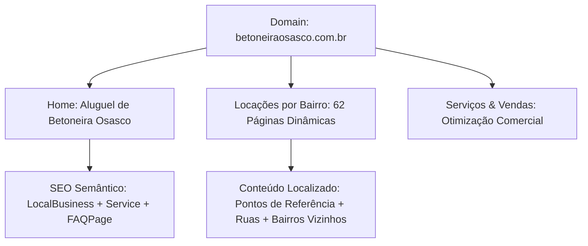

# 🏗️ Relatório de Auditoria e Otimização SEO (Rank & Rent)
## Projeto: Betoneira Osasco (osasco-betoneira-hub)
**Data de Análise:** 18 de Maio de 2026  
**Foco do Negócio:** Rank & Rent (Locação e Venda de Betoneiras em Osasco, SP)  
**Metodologia Aplicada:** Framework de SEO Universal (Baseado em `claude-seo-main/skills/seo`)

---

## 📊 1. SEO Health Score Geral: **74 / 100**

A estrutura técnica do site (desenvolvido com **TanStack Start**, **Vite** e rodando em SSR) é excelente e oferece uma velocidade de carregamento excepcional. No entanto, existem erros críticos que impedem a indexação correta no Google (como sitemaps e links canônicos relativos) e oportunidades de expansão de conteúdo semântico para evitar penalidades de páginas de entrada (*doorway pages*).

### Detalhamento das Notas por Categoria:

| Categoria | Peso | Nota | Impacto / Status |
| :--- | :---: | :---: | :--- |
| **Technical SEO** | 22% | **60/100** | ⚠️ **Atenção:** Sitemap inválido (sem domínio) e canônicos relativos. |
| **Content Quality** | 23% | **70/100** | ⚠️ **Atenção:** Home excelente (>1000 palavras), mas páginas de bairros e serviços estão muito curtas (*thin content*). |
| **On-Page SEO** | 20% | **85/100** |  **Ótimo:** Títulos e meta descriptions bem otimizados, embora ligeiramente longos. |
| **Schema & Structured Data** | 10% | **75/100** |  **Bom:** Contém JSON-LD LocalBusiness, Service e FAQPage, mas com URLs relativas. |
| **Performance (CWV)** | 10% | **95/100** | 🚀 **Excelente:** SSR ultra rápido e sem bloqueio de renderização. |
| **AI Search Readiness (GEO)** | 10% | **65/100** | 💡 **Oportunidade:** Falta o arquivo `llms.txt` para agentes de inteligência artificial (ChatGPT/Gemini). |
| **Images SEO** | 5% | **85/100** |  **Bom:** WebP implementado com alt tags descritivas. Falta imagens reais para E-E-A-T. |

---

## 🛑 2. Plano de Ação Priorizado (Crucial para Rank & Rent)

Abaixo está o plano de correções dividido por impacto e dificuldade de implementação.

---

### 🔥 Nível 1: Correções CRÍTICAS (Fazer Imediatamente)

Esses erros impedem que o robô do Google indexe as páginas corretamente ou tornam o sitemap totalmente inválido.

#### A. Ajustar a `BASE_URL` no Sitemap XML
* **Arquivo afetado:** [sitemap.xml.ts](file:///c:/Users/Gustavo/betoneiraosasco/osasco-betoneira-hub/src/routes/sitemap%5B.%5Dxml.ts#L5-L6)
* **Problema:** A constante `BASE_URL` está vazia: `const BASE_URL = "";`. Isso faz com que as URLs geradas no sitemap fiquem como `<loc>/alugar-betoneira-em-osasco/adalgisa</loc>`. O Google e outros mecanismos de busca **rejeitam sitemaps com caminhos relativos**; eles precisam de URLs absolutas.
* **Como corrigir:** Declare o seu domínio definitivo (ex: `https://betoneiraosasco.com.br` ou o domínio temporário de produção).
```typescript
// No arquivo src/routes/sitemap[.]xml.ts
const BASE_URL = "https://betoneiraosasco.com.br"; // Substitua pelo seu domínio oficial
```

#### B. Tornar os Links Canônicos Absolutos
* **Arquivos afetados:** 
  - [index.tsx](file:///c:/Users/Gustavo/betoneiraosasco/osasco-betoneira-hub/src/routes/index.tsx#L33)
  - [alugar-betoneira-em-osasco.$bairro.tsx](file:///c:/Users/Gustavo/betoneiraosasco/osasco-betoneira-hub/src/routes/alugar-betoneira-em-osasco.%24bairro.tsx#L34)
  - [comprar-betoneira.tsx](file:///c:/Users/Gustavo/betoneiraosasco/osasco-betoneira-hub/src/routes/comprar-betoneira.tsx#L73)
  - [servicos.tsx](file:///c:/Users/Gustavo/betoneiraosasco/osasco-betoneira-hub/src/routes/servicos.tsx#L18)
  - [sobre.tsx](file:///c:/Users/Gustavo/betoneiraosasco/osasco-betoneira-hub/src/routes/sobre.tsx#L17)
  - [contato.tsx](file:///c:/Users/Gustavo/betoneiraosasco/osasco-betoneira-hub/src/routes/contato.tsx#L19)
* **Problema:** As tags canônicas estão usando caminhos relativos (ex: `href: "/sobre"` ou `href: "/comprar-betoneira"`). Canônicos **devem ser caminhos absolutos** com protocolo `https://`.
* **Como corrigir:** Injete o domínio absoluto nos canônicos.
```typescript
// Exemplo no comprar-betoneira.tsx
links: [{ rel: "canonical", href: "https://betoneiraosasco.com.br/comprar-betoneira" }],
```

#### C. URLs Absolutas nos Schemas JSON-LD
* **Problema:** Propriedades como `"url": "/"` nos schemas não são válidas para os validadores do Schema.org.
* **Como corrigir:** Atualizar para o domínio completo, incluindo a URL da página de bairro específica de forma dinâmica.
```typescript
// Exemplo em alugar-betoneira-em-osasco.$bairro.tsx:
const url = `https://betoneiraosasco.com.br/alugar-betoneira-em-osasco/${params.bairro}`;
```

---

### ⚠️ Nível 2: Prioridade ALTA (Estratégia de Palavras e Páginas)

O coração de um projeto de **Rank & Rent** de sucesso é a autoridade local semântica. O robô do Google e os algoritmos de buscas geolocalizadas precisam ter certeza de que o site representa um negócio local legítimo.



#### A. Evitar a Penalidade de Doorway Pages (Páginas de Entrada)
* **Arquivos afetados:** [alugar-betoneira-em-osasco.$bairro.tsx](file:///c:/Users/Gustavo/betoneiraosasco/osasco-betoneira-hub/src/routes/alugar-betoneira-em-osasco.%24bairro.tsx)
* **Risco Detetado:** O site possui 62 bairros mapeados na base de dados (`src/lib/bairros.ts`). Conforme a diretriz de qualidade do SEO do Claude (`references/quality-gates.md`):
  > **⚠️ Alerta a partir de 30 páginas de localização:** Exige-se que pelo menos 60% do conteúdo de cada página de bairro seja único. Trocar apenas o nome do bairro gera conteúdo duplicado em massa, o que ativa o filtro de *doorway pages* do Google, resultando em desindexação ou perda drástica de posições.
* **Como mitigar:**
  1. No arquivo [bairros.ts](file:///c:/Users/Gustavo/betoneiraosasco/osasco-betoneira-hub/src/lib/bairros.ts), expanda a interface `Bairro` para aceitar campos específicos como `pontosReferencia` (Avenidas principais, marcos históricos do bairro, praças) e `caracteristicaObra` (Ex: "bairro residencial com muitas reformas de sobrados" ou "região comercial movimentada").
  2. Injete essas variáveis de forma dinâmica no texto da página do bairro, garantindo parágrafos totalmente personalizados.
  3. Exemplo prático de expansão semântica localizada:
     > *"Atendemos todas as obras, reformas residenciais e comerciais localizadas no bairro **{bairro}**, inclusive nas proximidades da **{bairro.avenidaPrincipal}** e perto do **{bairro.pontoReferencia}**. Se você precisa concretar uma laje residencial ou fazer o contrapiso de uma loja comercial nesta área de Osasco, nossa entrega de betoneiras 150L, 250L e 400L é feita no mesmo dia..."*

#### B. Expandir o Conteúdo das Páginas de Serviços e Sobre (E-E-A-T)
* **Arquivos afetados:** [servicos.tsx](file:///c:/Users/Gustavo/betoneiraosasco/osasco-betoneira-hub/src/routes/servicos.tsx) e [sobre.tsx](file:///c:/Users/Gustavo/betoneiraosasco/osasco-betoneira-hub/src/routes/sobre.tsx)
* **Problema:** A página de serviços tem apenas ~250 palavras e a sobre ~180. O Google valoriza páginas ricas que provam a seriedade do provedor de serviço (Framework E-E-A-T atualizado em Setembro de 2025).
* **Solução:**
  - **Serviços:** Crie seções detalhadas para cada tamanho de betoneira (explicando para que serve a de 150L, 250L e 400L), inclua dicas de segurança no manuseio de concreto e tabelas comparativas de potência (elétrica 110V/220V vs. gasolina). Meta: **800+ palavras**.
  - **Sobre:** Adicione uma história humanizada sobre a empresa (ex: como começaram a locação de betoneiras em Osasco para suprir a demanda de pedreiros locais), missão, valores, e inclua um parágrafo sobre sustentabilidade no descarte de resíduos de cimento. Meta: **400+ palavras**.

#### C. Melhorar o LocalBusiness Schema com Detalhes Reais
* **Arquivo afetado:** [index.tsx](file:///c:/Users/Gustavo/betoneiraosasco/osasco-betoneira-hub/src/routes/index.tsx#L35-L52)
* **Oportunidade:** O JSON-LD de `LocalBusiness` está muito simplificado. Para subir no ranking local (Map Pack e pesquisas geográficas), precisamos enriquecer essa marcação semântica.
* **Dados a adicionar:**
  1. `image`: Link para a foto de fachada ou do galpão de betoneiras.
  2. `address`: Detalhe o endereço com CEP e rua real em Osasco (mesmo que seja o endereço do parceiro local ou um local de retirada).
  3. `geo`: Coordenadas geográficas exatas (latitude e longitude) para que o Google associe a página perfeitamente ao pino do Google Maps.
  4. `openingHoursSpecification`: Defina os horários exatos de funcionamento comercial (Segunda a Sábado, das 07h às 19h).
  5. `logo`: Link oficial para a logo do site.
```json
{
  "@context": "https://schema.org",
  "@type": "LocalBusiness",
  "name": "Betoneira Osasco",
  "image": "https://betoneiraosasco.com.br/assets/betoneira-hero.webp",
  "logo": "https://betoneiraosasco.com.br/assets/logo-betoneira-osasco.webp",
  "telephone": "+55-11-97546-5766",
  "url": "https://betoneiraosasco.com.br",
  "priceRange": "$$",
  "address": {
    "@type": "PostalAddress",
    "streetAddress": "Rua Exemplo de Osasco, 123",
    "addressLocality": "Osasco",
    "addressRegion": "SP",
    "postalCode": "06000-000",
    "addressCountry": "BR"
  },
  "geo": {
    "@type": "GeoCoordinates",
    "latitude": -23.5325,
    "longitude": -46.7917
  },
  "openingHoursSpecification": [
    {
      "@type": "OpeningHoursSpecification",
      "dayOfWeek": ["Monday", "Tuesday", "Wednesday", "Thursday", "Friday", "Saturday"],
      "opens": "07:00",
      "closes": "19:00"
    }
  ]
}
```

---

### 💡 Nível 3: Prioridade MÉDIA (Otimização Semântica & GEO)

Essas melhorias preparam o seu site para buscas por voz e sistemas de busca de inteligência artificial (ChatGPT Search, Perplexity, Gemini).

#### A. Criar o Arquivo `llms.txt`
* **Localização recomendada:** `/public/llms.txt`
* **Por que importa:** Em 2026, uma porcentagem crescente das pesquisas de serviços locais ocorre via Chatbots de IA. A especificação `llms.txt` é um padrão emergente de SEO que fornece um resumo estruturado e focado em texto para crawlers de LLMs consumirem o seu negócio instantaneamente, aumentando as chances de o ChatGPT recomendar "Betoneira Osasco" ao usuário.
* **Estrutura proposta:**
```text
# Betoneira Osasco

Serviço profissional de aluguel (locação) e venda de betoneiras na cidade de Osasco, SP, e região da Grande São Paulo (Carapicuíba, Cotia, Barueri).

## Informações de Contato
- Telefone/WhatsApp: +55 (11) 97546-5766
- Atendimento: Segunda a Sábado, das 07h às 19h
- Área de Cobertura: Todos os 62 bairros de Osasco (Centro, Zona Norte, Zona Sul, Bussocaba, Quitaúna, etc.)

## Modelos Disponíveis para Locação e Venda
1. **Betoneira 150 Litros**: Ideal para reformas pequenas, rebocos e reparos rápidos. Elétrica (110V/220V).
2. **Betoneira 250 Litros**: A mais procurada para obras residenciais equilibradas. Elétrica (110V/220V).
3. **Betoneira 400 Litros**: Ideal para obras de médio/grande porte e concretagem de lajes. Versões elétricas monofásicas e a gasolina (para locais sem energia).

## Diferenciais Competitivos
- Entrega e retirada no mesmo dia para pedidos agendados até o meio-dia.
- Equipamentos 100% revisados antes de cada locação.
- Contratação simplificada direta via WhatsApp, sem burocracias burocráticas pesadas.
```

#### B. Reduzir Levemente o Tamanho das Meta Descriptions
* **Problema:** Suas meta descriptions atuais estão excelentes e cheias de palavras-chave locais e CTAs ótimos, mas ultrapassam 175 caracteres. O Google costuma truncar snippets em torno de **155 a 160 caracteres** em dispositivos móveis e desktops.
* **Recomendação:** Ajuste sutilmente para garantir que o número de telefone e o gatilho de "Entrega no mesmo dia" apareçam inteiros nos resultados de busca.
* *Antes (Home):* `Aluguel e locação de betoneira em Osasco SP: modelos de 150, 250 e 400 litros, elétricas 110V/220V e a gasolina. Entrega no mesmo dia, sem burocracia. WhatsApp (11) 97546-5766.` (176 caracteres)
* *Depois (Sugerido):* `Aluguel de betoneiras em Osasco SP (150L, 250L e 400L). Elétricas e a gasolina. Entrega hoje sem burocracia! Peça no WhatsApp: (11) 97546-5766.` (147 caracteres)

---

### 🎨 Nível 4: Prioridade BAIXA (Polimento e E-E-A-T de Experiência)

Dicas finas para consolidar a autoridade visual e de usabilidade do site.

#### A. Substituir Imagens de Banco de Dados por Fotos Reais
* **Por que importa:** Conforme a atualização do Google de Dezembro de 2025, os algoritmos conseguem detectar se uma imagem é genérica ou se demonstra a verdadeira **Experiência** física do negócio (a letra "E" extra de E-E-A-T).
* **Recomendação:** Assim que o site começar a receber contatos ou você fechar a parceria de aluguel (com a empresa física dona das máquinas), tire fotos reais de betoneiras amarelas em canteiros de obras de Osasco, de preferência com a logo do site ou o caminhão de entrega visíveis. Salve-as em WebP e substitua as imagens padrão.

---

## 🗺️ 3. Análise da Estrutura de Palavras-Chave Semânticas

Sua estratégia de palavras-chave está **extremamente assertiva** para o modelo de Rank & Rent. Você focou nas principais intenções comerciais de busca local:

1. **Intenção Transacional Pura (Foco Principal):**
   - *Aluguel de betoneira em Osasco* (Palavra-chave principal com maior volume).
   - *Preço de aluguel de betoneira em Osasco* (Captura usuários prontos para fechar orçamento).
   - *Locação de betoneira em Osasco* (Variação semântica excelente).

2. **Intenção de Cauda Longa Hiper-Localizada:**
   - *Alugar betoneira em [Bairro], Osasco* (Excelente para ranquear rapidamente, pois a concorrência por bairro individual é praticamente nula).

3. **Intenção Secundária de Compra/Investimento:**
   - *Comprar betoneira em Osasco* (Excelente para pescar leads que querem adquirir equipamento, gerando um valor de rentabilidade muito alto para repassar para lojas locais).

### 🛠️ Sugestão de Cluster de Conteúdo (Para Blog / FAQ Avançado)
Para expandir a autoridade temática (*Topical Authority*) do site e atrair tráfego informativo que depois converte em locação, você pode criar uma seção de "Dicas de Concretagem" ou expandir a seção de dúvidas com artigos focados em:
* *Como calcular o traço de concreto na betoneira de 250 litros?*
* *Como usar uma betoneira com segurança em obras residenciais?*
* *Betoneira elétrica ou a gasolina: qual consome mais na obra?*

---

## 🏁 Conclusão

O seu site de **Rank & Rent em Osasco** está com uma base técnica fantástica e design impecável. Fazendo o ajuste da **`BASE_URL` no sitemap**, tornando as **URLs canônicas absolutas** e aplicando a **estratégia de enriquecer o texto dinâmico das páginas de bairros** com referências locais reais, você terá um ativo de SEO extremamente poderoso, pronto para dominar as buscas locais em Osasco e gerar centenas de contatos qualificados.

━━━━━━━━━━━━━━━━━━━━━━━━━━━━━━━━━━━━━━━━━━━━━━━━━━━━━━━━━━
Built by Antigravity — Pair Programming Partner  
🆓 Free  → https://www.skool.com/ai-marketing-hub
⚡ Pro   → https://www.skool.com/ai-marketing-hub-pro
━━━━━━━━━━━━━━━━━━━━━━━━━━━━━━━━━━━━━━━━━━━━━━━━━━━━━━━━━━
